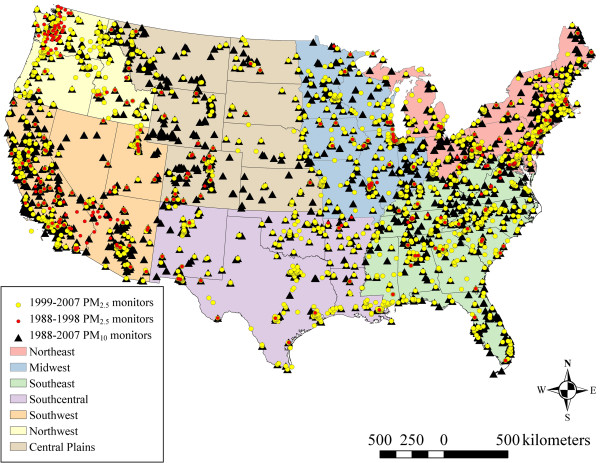

<!--
Describe the biological motivation for this case study.
Include relevant explanatory images and references throughout.
See this previous case study as an example: https://www.opencasestudies.org/ocs-bp-co2-emissions/#Motivation
Images or videos may be helpful so this includes an example of including an image.
-->

# **Motivation**
***
This case study explores {}...

:::{.definition_box}
::::{.definition_box_header}
Definition
::::
::::{.inner_block}
Provide the definition here
::::
:::

Images are very helpful within this section....

{fig-alt="Map showing location of air pollution monitors across the US." width=800 .lightbox}

In these background citations, you may want to reference information like [knuth, 1984](https://doi.org/10.1093/comjnl/27.2.97) [@knuth84]. These will automatically be added into the @refs subsection of the Additional Information section. It is good to also add a direct link the the reference where appropriate.  See the references.bib file for where `@knuth84` came from. Tools like Zotero can help you get the bib version of the citation and some journals will help you copy paste it more readily.

***
